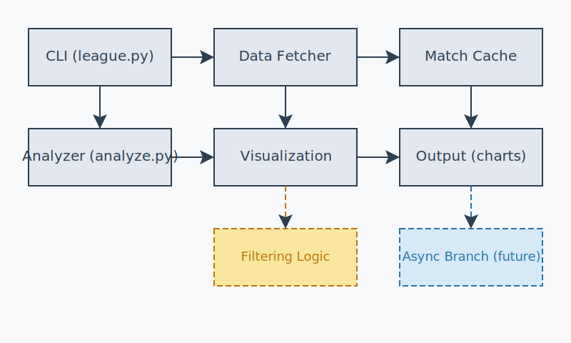

# Architecture

Use this page as a quick, practical map of how League Stats works. It shows the flow of data, the key components, and the most common extension points.



## 1) Data flow (at a glance)
```
Riot API → league.ensure_matches_for_player (async-first; sync fallback)
         → matches/*.json
         → analysis/visualizations (via CLI or Streamlit GUI)
         → output/*.png

Side channels:
• Config: config.env auto-loaded via python-dotenv
• Logging: logs/league_stats.log (centralized file logging)
```

## 2) Entry points
- CLI
  - `python -m stats_visualization.league`: fetch/caching
  - `python analyze.py`: analysis and figure generation
  - Async-first (httpx + asyncio) with safe sync fallback (requests) when httpx is absent

- Streamlit GUI (`stats_visualization/gui_app.py`)
  - Same analysis/visualization pipeline as the CLI
  - Saves figures in `output/` and logs to `logs/league_stats.log`

## 3) Components
- `league.py`
  - `fetch_puuid_by_riot_id(game_name, tag_line, token)`
  - `fetch_match_ids(puuid, count)`
  - `fetch_match(match_id, token)` (optionally includes timeline)
  - `ensure_matches_for_player(puuid, token, matches_dir, min_matches, fetch_count)`
  - Async-first, guarded by optional `httpx` with requests-based fallback
  - Caching: skips duplicates using existing JSON filenames

- `analyze.py`
  - CLI for player/team analysis; optional auto-fetch when local data is low
  - Aggregates player statistics (K/D/A, win rate, roles, champions, gold, damage)

- Visualization scripts (`visualizations/*.py`)
  - Load matches via `analyze.load_match_files()` or helper
  - Derive metrics and produce Matplotlib figures saved to `output/`

- Utilities (`stats_visualization/utils.py`)
  - `setup_file_logging()` (centralized file logging)
  - Helpers like `filter_matches`, `save_figure`, `sanitize_player`

## 4) Storage
- `matches/`: raw match JSON (`<MATCH_ID>.json`)
- `output/`: chart images (`<chart_type>_<player>.png`)
- `logs/league_stats.log`: unified app log (CLI, Analyze, GUI)

## 5) Behavior and guarantees
- Caching: Duplicate match IDs are not re-written
- Error handling: Network/API errors logged; best-effort continuation
- Case-insensitive Riot ID resolution: `analyze.py` tries casing variants for IGN + tag line
- Auto-fetch logic:
  1) Count local matches containing the player PUUID
  2) If below minimum and token present, run `ensure_matches_for_player`
  3) Reload and summarize before/after counts

## 6) Extending the system
To add a new visualization:
1) Create a script in `visualizations/`
2) Import `analyze.load_match_files` and `league` as needed
3) Compute your metrics
4) Save a figure to `output/` with a descriptive filename
5) Document it in `visualizations_catalog.md` and `cli_reference.md`

Notes
- Fetching is async-first with a sync fallback to keep the CLI/GUI robust
- In headless environments, Matplotlib uses the ‘agg’ backend automatically
